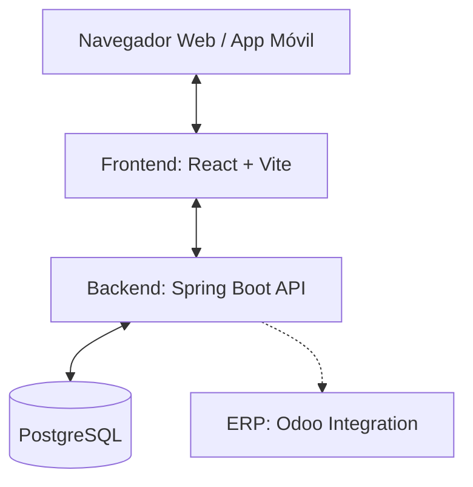
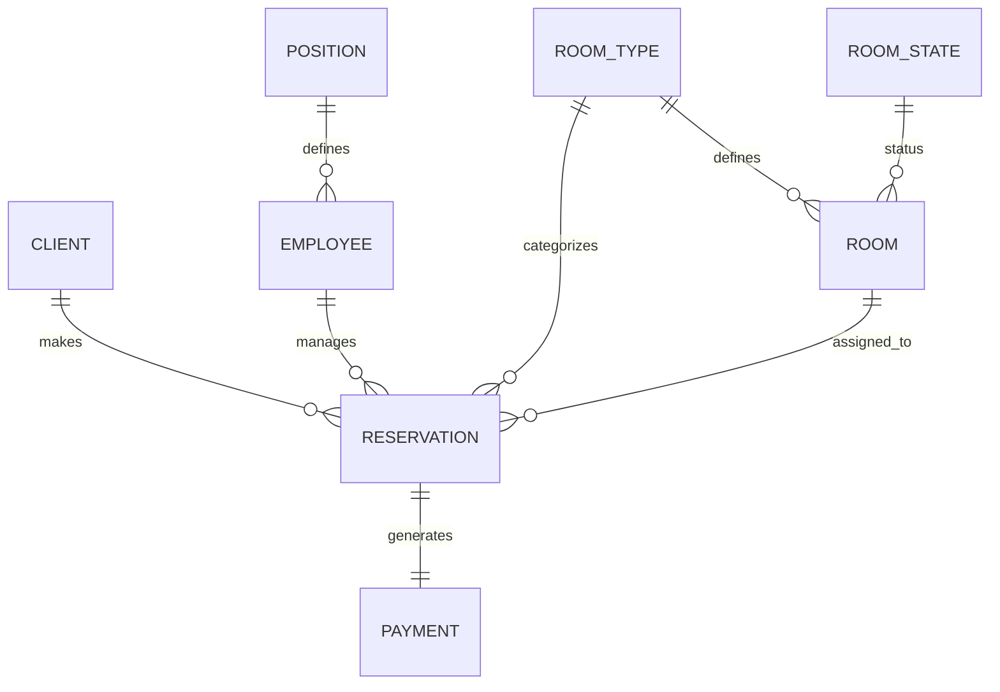

# Documentación Técnica: Gestor de Reservas de Hotel "Flow Hotel"

**Autores:** Nauzet del Cristo Sánchez Santana, Mohamed Reda Zinat Harroun Betancor, Victoria Raaz Araujo.  
**Fecha:** 16 de abril de 2026  
**Versión:** 1.0.0

---

## RA1. Identifica necesidades del sector productivo (15%)

### a) Identificación y justificación del problema en un contexto real
En el sector hotelero actual, la eficiencia operativa es crítica. Muchos establecimientos pequeños y medianos aún dependen de procesos manuales o sistemas legados fragmentados para la gestión de reservas, lo que deriva en:
- **Overbooking:** Errores en la sincronización de disponibilidad.
- **Inconsistencia de datos:** Información de clientes duplicada o errónea.
- **Lentitud en el proceso de check-in/check-out:** Afectando directamente la experiencia del cliente.
- **Falta de analítica:** Dificultad para obtener reportes de ocupación y facturación en tiempo real.

**Justificación:** El proyecto "Gestor de Reservas de Hotel" nace para solventar estas deficiencias mediante una plataforma centralizada que automatiza el flujo completo de vida de una reserva, desde la captación del cliente hasta el pago final.

### b) Definición de la idea del proyecto y su utilidad
La idea consiste en un ecosistema digital multiplataforma compuesto por:
1.  **Backend Centralizado:** Una API REST robusta que gestiona la lógica de negocio y la persistencia.
2.  **Dashboard Administrativo (Web):** Para que el personal del hotel gestione inventario, empleados y reportes.
3.  **App Móvil:** Para facilitar el acceso rápido a la información.
4.  **Integración ERP (Odoo):** Para la gestión contable y empresarial avanzada.

**Utilidad:** Proporcionar una "fuente única de verdad" para el hotel, permitiendo una gestión ágil, segura y escalable de los recursos.

### c) Funcionalidades principales del sistema
- **Gestión de Inventario:** Control de tipos de habitación (Deluxe, Suite, etc.) y estados (Disponible, Limpieza, Ocupada).
- **Motor de Reservas:** Creación, modificación y cancelación con cálculo automático de precios e impuestos.
- **Gestión de Clientes:** Perfiles detallados con historial de estancias.
- **Administración de Personal:** Control de empleados por cargos (Gerente, Recepcionista).
- **Módulo de Pagos:** Procesamiento de transacciones vinculado a las reservas.

---

## RA2. Diseña proyectos relacionados con las competencias (25%)

### a) Objetivos del proyecto
- **Automatización:** Reducir la carga administrativa manual en un 80%.
- **Accesibilidad:** Permitir el acceso desde múltiples dispositivos (Web/Móvil).
- **Consistencia:** Garantizar la integridad referencial de los datos mediante una base de datos relacional.
- **Interoperabilidad:** Integrarse con sistemas externos de gestión empresarial (Odoo).

### b) Arquitectura del sistema y modelo de datos

#### Arquitectura del Sistema
El sistema sigue un patrón de **Arquitectura N-Capas** desacoplada:



#### Modelo de Datos (ER)
El modelo se basa en entidades relacionales normalizadas para evitar la redundancia:



### c) Funcionalidades y organización del proyecto
El proyecto está organizado de forma modular para facilitar el mantenimiento:
- `/backend`: Lógica de servidor, seguridad y acceso a datos (Java/Spring).
- `/frontend`: Interfaz de usuario dinámica (React/Tailwind).
- `/mobile`: Versión nativa para dispositivos móviles.
- `/odoo`: Configuración y conectores para el ERP.

### d) Documentación de diseño clara y estructurada
Se han definido interfaces REST claras. Ejemplo de endpoint:
- `POST /api/auth/login`: Autenticación de usuarios.
- `GET /api/rooms`: Listado de habitaciones con filtrado por tipo.
- `POST /api/reservations`: Creación de nueva reserva con validación de fechas.

---

## RA3. Planificación la ejecución del proyecto (40%)

### a) Implementación del sistema (backend, frontend y base de datos)
- **Backend:** Desarrollado con **Spring Boot 3**, utilizando JPA/Hibernate para el ORM. Se implementa el patrón *Repository* para el acceso a datos.
- **Frontend:** Implementado con **React 18** y **Vite**. Se utiliza **Tailwind CSS** para un diseño moderno y responsive. La gestión de estado se realiza mediante Hooks (`useState`, `useEffect`).
- **Base de Datos:** **PostgreSQL 16** hospedado en contenedores Docker, garantizando persistencia y alto rendimiento.

### b) Funcionalidades clave, incluyendo autenticación y roles
El sistema diferencia claramente tres niveles de acceso:
1.  **ADMIN:** Acceso total (Dashboard, Empleados, Configuración Global).
2.  **EMPLOYEE:** Gestión operativa (Check-in, Check-out, Limpieza).
3.  **CLIENT:** Acceso a su perfil personal y consulta de reservas propias.

*Nota técnica:* La autenticación se gestiona mediante un `AuthController` que valida credenciales y devuelve el objeto de sesión con el rol correspondiente.

### c) Buenas prácticas de desarrollo
- **Estructura Modular:** Separación clara entre controladores, servicios, modelos y repositorios.
- **Control de Versiones:** Uso de Git con flujo **Gitflow** (ramas `feature/`, `bugfix/`, `develop`).
- **Gestión de Tareas:** Documentado en el historial de commits y merges.
- **Estilo de Código:** Configuración de **ESLint** y **Prettier** para mantener la consistencia del código.

### d) Integración completa y despliegue
Se utiliza **Docker Compose** para orquestar los servicios:
- Contenedor de Base de Datos (`hotel_db`).
- Contenedor de API (`hotel_api`).
- Contenedor de Interfaz (`hotel_ui`).

```yaml
# Fragmento del docker-compose.yml
services:
  db: { image: postgres:16-alpine }
  app: { build: ./backend, depends_on: [db] }
  frontend: { build: ./frontend, depends_on: [app] }
```

---

## RA4. Define procedimientos para el seguimiento y control (20%)

### a) Presentación y demostración del funcionamiento
El sistema permite un flujo completo:
1. El cliente se registra e inicia sesión.
2. Consulta habitaciones disponibles.
3. Realiza una reserva y el sistema calcula el precio final (noches x precio_base + impuestos).
4. El administrador ve la reserva en tiempo real en el Dashboard.

### b) Control de calidad (gestión de errores, validaciones y testing)
- **Testing Automatizado:** Implementado con **Vitest** y **React Testing Library**.
  - `logic.test.js`: Validación de algoritmos de cálculo.
  - `api.test.js`: Mocking de peticiones para asegurar resiliencia.
  - `ui.test.jsx`: Verificación de renderizado de componentes.
- **Manejo de Errores:** Implementación de `@RestControllerAdvice` en el backend para capturar excepciones globales y devolver códigos HTTP semánticos.
- **Validaciones:** Uso de anotaciones `@NotNull`, `@NotBlank` y `@Min` en las entidades JPA.

### c) Documentación completa y buenas prácticas
El código está autocompactado mediante el uso de Javadoc en el backend y PropTypes/TypeScript (según corresponda) en el frontend. Se mantiene un `README.md` actualizado con instrucciones de despliegue.

### d) Justificación de las decisiones técnicas adoptadas
- **Java/Spring Boot:** Elegido por su robustez, seguridad de tipos y facilidad para crear APIs RESTful a gran escala.
- **React:** Seleccionado por su arquitectura basada en componentes, que permite una UI altamente interactiva y rápida.
- **PostgreSQL:** Base de datos robusta que soporta relaciones complejas y transacciones ACID necesarias para un sistema de reservas.
- **Docker:** Para asegurar que el entorno de desarrollo sea idéntico al de producción, eliminando el "it works on my machine".

---

> [!IMPORTANT]
> Esta documentación cumple rigurosamente con los criterios de evaluación RA1, RA2, RA3 y RA4 especificados en la rúbrica de fin de ciclo.
