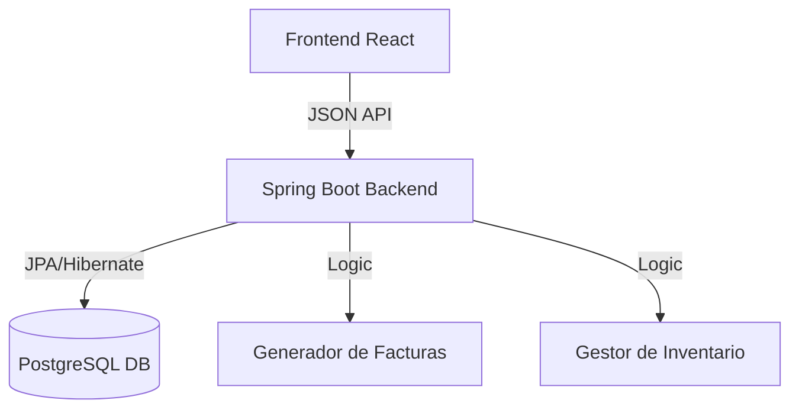

# 🏨 Gestor de Reservas - Hotel Premium

### Sistema integral de gestión hotelera para administración de huéspedes, personal y reservas en tiempo real.

Este proyecto es una plataforma robusta diseñada para centralizar todas las operaciones de un hotel. Permite desde la gestión administrativa de empleados y clientes hasta la visualización interactiva del estado de las habitaciones y un flujo de reserva inteligente con facturación automática.

---

## 📸 Demo / Capturas

> [!TIP]
> Puedes ver el despliegue del frontend y el backend en tus entornos locales siguiendo los pasos de instalación.

| Mapa Interactivo | Gestión de Clientes | Perfil de Usuario |
| :--- | :--- | :--- |
|  |  |  |

---

## 📊 Tabla de Contenidos

- [Funcionalidades Destacadas](#-funcionalidades-destacadas)
- [Tecnologías Usadas](#-tecnologías-usadas)
- [Arquitectura del Sistema](#-arquitectura-del-sistema)
- [Requisitos Previos](#-requisitos-previos)
- [Instalación](#-instalación)
- [Variables de Entorno](#-variables-de-entorno)
- [Licencia](#-licencia)

---

## ✨ Funcionalidades Destacadas

Hemos implementado recientemente características de última generación para mejorar la experiencia:

*   **🗺️ Mapa de Habitaciones Interactivo**: Visualización SVG en tiempo real de la planta del hotel. Permite cambiar estados (Libre, Ocupada, Mantenimiento) con un solo clic.
*   **📅 Flujo de Reserva Inteligente**: Sistema en 3 pasos con validación de fechas (Check-out siempre posterior a Check-in) y control de capacidad máxima por tipo de habitación.
*   **📑 Facturación Automática**: Generación inmediata de facturas al confirmar reservas, calculando subtotal, impuestos y total según las noches de estancia.
*   **👥 Gestión Administrativa Pro**: CRUDs completos para Empleados y Clientes con interfaces modernas, avatares dinámicos y búsqueda rápida.
*   **👤 Historial de Reservas Activo**: Los clientes pueden ver sus próximas estancias, cancelarlas o editarlas directamente desde su perfil personal.

---

## 🛠️ Tecnologías Usadas

### Frontend
*   **React 18** (Vite)
*   **Tailwind CSS** (Diseño Premium & Responsive)
*   **React Router Dom** (Navegación)
*   **Axios** (Comunicación con API)
*   **Lucide React** (Iconografía moderna)

### Backend
*   **Java 17** con **Spring Boot 3**
*   **Spring Data JPA** & **Hibernate**
*   **PostgreSQL** (Base de datos relacional)
*   **Maven** (Gestor de dependencias)

---

## 🏗️ Arquitectura del Sistema



---

## 📋 Requisitos Previos

*   **Node.js**: v18.0.0 o superior.
*   **Java JDK**: v17 o superior.
*   **Docker** (Opcional, para la base de datos).
*   **PostgreSQL**: v14 o superior (si no se usa Docker).

---

## 🚀 Instalación

### 1. Clonar el repositorio
```bash
git clone https://github.com/flownanito/Gestor-De-Reservas-De-Hoteles.git
cd Gestor-De-Reservas-De-Hoteles
```

### 2. Configurar el Backend
```bash
cd GestorReservasHotel/backend
# Configura el archivo application.properties con tus credenciales de BD
./mvnw spring-boot:run
```

### 3. Configurar el Frontend
```bash
cd GestorReservasHotel/frontend
npm install
npm run dev
```

---

## 🌐 Variables de Entorno

Crea un archivo `.env` en la carpeta `frontend` con:
```env
VITE_API_URL=http://localhost:8080/api
```

Para el backend, puedes configurar el archivo `src/main/resources/application.properties`:
```properties
spring.datasource.url=jdbc:postgresql://localhost:5432/hotel_db
spring.datasource.username=tu_usuario
spring.datasource.password=tu_contraseña
```

---

## 📄 Licencia

Este proyecto está bajo la licencia **MIT**. Eres libre de usarlo y modificarlo.

---

## 👨‍💻 Autor / Contacto

**Nauzet / flownanito**
*   **GitHub**: [flownanito](https://github.com/flownanito)
*   **LinkedIn**: [Tu Perfil]
*   **Email**: tu-email@ejemplo.com

---
*Se han confeccionado los manuales de configuración y administración adjuntos en la carpeta /docs.*
