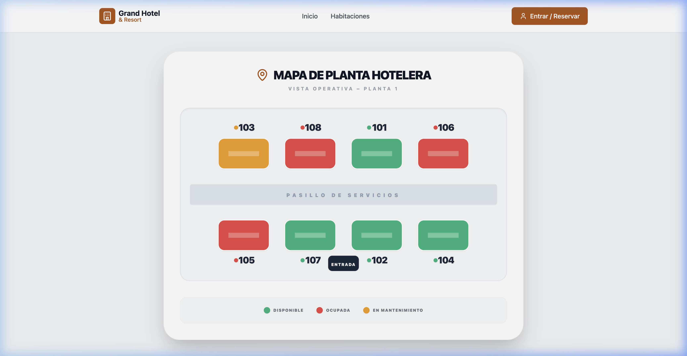
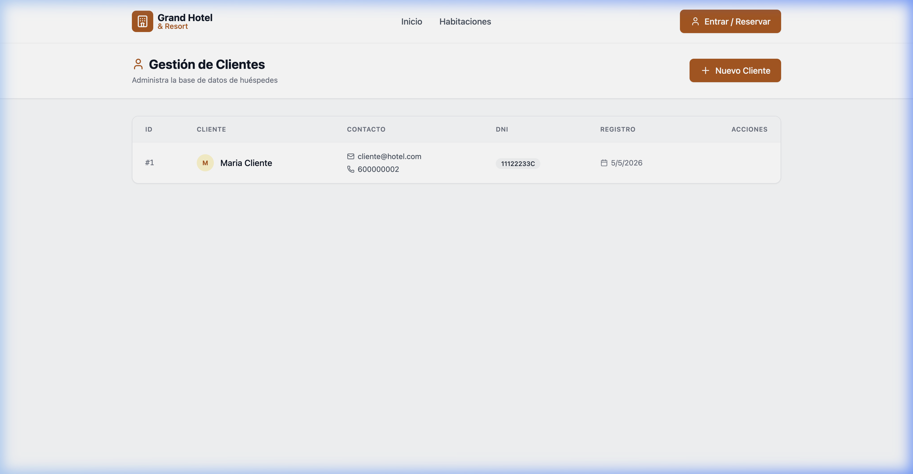
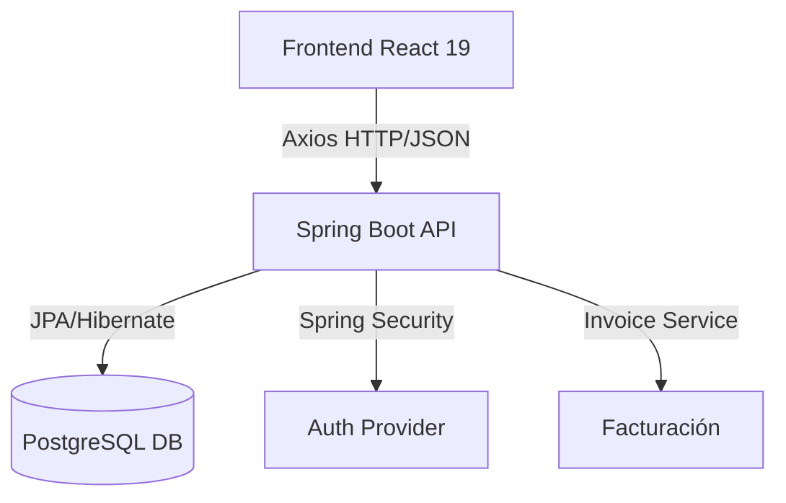

# 🏨 Gestor de Reservas - Hotel Premium

### Sistema integral de gestión hotelera para administración de huéspedes, personal y reservas en tiempo real.

Este proyecto es una plataforma robusta diseñada para centralizar todas las operaciones de un hotel. Permite desde la gestión administrativa de empleados y clientes hasta la visualización interactiva del estado de las habitaciones y un flujo de reserva inteligente con facturación automática.

---

## 📸 Demo / Capturas Reales

| Pantalla de Login | Mapa Interactivo de Habitaciones | Gestión de Clientes |
| :---: | :---: | :---: |
|  |  |  |

---

## 📊 Tabla de Contenidos

- [Funcionalidades Destacadas](#-funcionalidades-destacadas)
- [Tecnologías Usadas](#-tecnologías-usadas)
- [Arquitectura del Sistema](#-arquitectura-del-sistema)
- [Requisitos Previos](#-requisitos-previos)
- [Instalación](#-instalación)
- [Variables de Entorno](#-variables-de-entorno)
- [Licencia](#-licencia)

---

## ✨ Funcionalidades Destacadas

*   **🗺️ Mapa de Habitaciones Interactivo**: Visualización SVG dinámica de la planta del hotel. Permite gestionar estados (Libre, Ocupada, Mantenimiento) de forma visual.
*   **📅 Reserva en 3 Pasos**: Flujo guiado con validación de fechas (Check-out > Check-in) y control estricto de capacidad por habitación.
*   **📑 Facturación Express**: Generación automática de facturas en PDF/JSON al confirmar la reserva, calculando noches, IVA (10%) y total.
*   **👥 Gestión Administrativa (CRUD)**: Paneles completos para Empleados y Clientes con diseño premium, avatares y búsqueda en tiempo real.
*   **👤 Perfil de Cliente con Historial**: Espacio personal donde los huéspedes pueden consultar, editar o cancelar sus propias reservas.

---

## 🛠️ Tecnologías Usadas

### Frontend
*   **React 19.2.0** (Vite 7.2.4)
*   **Tailwind CSS 3.4.1** (Diseño Moderno)
*   **React Router Dom 7.9.6** (Gestión de rutas)
*   **Axios 1.6.7** (Cliente API)
*   **Lucide React** (Iconografía)

### Backend
*   **Java 17** con **Spring Boot 3.3.5**
*   **Spring Data JPA** (Gestión de base de datos)
*   **PostgreSQL** (Persistencia de datos)
*   **Lombok** (Productividad en código)
*   **OpenAPI/Swagger 2.6.0** (Documentación de API)

---

## 🏗️ Arquitectura del Sistema



---

## 📋 Requisitos Previos

*   **Node.js**: v18.0.0 o superior (recomendado v20+).
*   **Java JDK**: v17.
*   **PostgreSQL**: Base de datos activa en puerto 5432.
*   **Maven**: Para la construcción del backend.

---

## 🚀 Instalación

### 1. Clonar el repositorio
```bash
git clone https://github.com/flownanito/Gestor-De-Reservas-De-Hoteles.git
cd Gestor-De-Reservas-De-Hoteles
```

### 2. Configurar el Backend
```bash
cd GestorReservasHotel/backend
# Configura application.properties con tus datos de PostgreSQL
./mvnw spring-boot:run
```

### 3. Configurar el Frontend
```bash
cd GestorReservasHotel/frontend
npm install
npm run dev
```

---

## 🌐 Variables de Env / Configuración

### Backend (`application.properties`)
```properties
spring.datasource.url=jdbc:postgresql://localhost:5432/hotel_db
spring.datasource.username=tu_usuario
spring.datasource.password=tu_contraseña
spring.jpa.hibernate.ddl-auto=update
```

---

## 👨‍💻 Autor / Contacto

**Nauzet / flownanito**
*   **GitHub**: [flownanito](https://github.com/flownanito)
*   **GitHub**: [depraider](https://github.com/depraider)
*   **GitHub**: [VictoriaRaaz](https://github.com/VictoriaRaaz)
